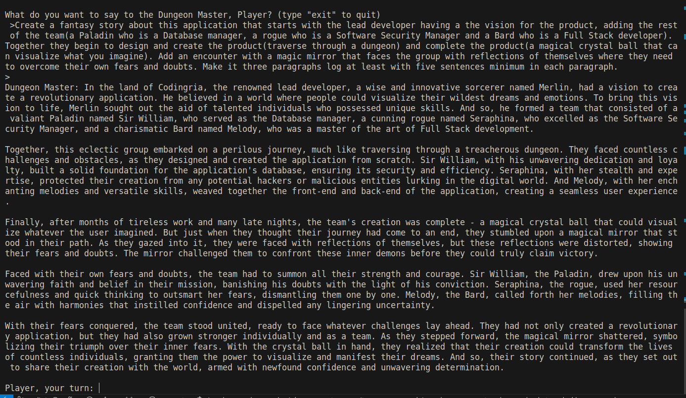

Demo Day Product for Holberton Coding School.

## Description:
1023 Forge is a web-based application designed to empower Dungeon Masters (DMs) in managing and orchestrating their Dungeons & Dragons (D&D) campaigns seamlessly. Built using a combination of JavaScript, MySQL, AWS (Amazon Web Services), and Node.js, the platform provides a robust and user-friendly environment for DMs to enhance their storytelling and game management capabilities.

**Languages and Frameworks Used:**
- **JavaScript:** The primary programming language for the frontend and backend development, ensuring a cohesive and responsive user interface.
- **MySQL:** A relational database management system utilized for storing and organizing game-related data, such as characters, spells, and campaign details.
- **AWS (Amazon Web Services):** AWS services are leveraged for scalable and secure cloud computing, enabling features like data storage, authentication, and possibly serverless functions.
- **Node.js:** As a server-side runtime, Node.js powers the backend, facilitating efficient handling of HTTP requests and seamless communication between the frontend and the database.

**Key Features:**

1. **User Registration and Authentication:**
   - Dungeon Masters can register accounts and log in securely, ensuring that their campaigns and data are protected.

2. **Character Management:**
   - DMs can create, update, and delete characters for their campaigns. The integration with external APIs, such as the D&D 5th Edition API, allows for easy access to a vast array of spells, monsters, and character details.

3. **Campaign Planning:**
   - A comprehensive campaign planning tool enables DMs to outline and organize their sessions. This includes the ability to create and manage story arcs, quests, and key plot points.

4. **Dynamic World Building:**
   - The application provides DMs with tools for building dynamic worlds. Real-time weather updates, environmental conditions, and random events based on external data sources, such as a weather API, contribute to an immersive gaming experience.

5. **Session Logging and Notes:**
   - DMs can log session details, take notes, and track the progression of their campaigns. This feature ensures that important decisions, NPC interactions, and player actions are documented for future reference.

6. **Interactive Maps:**
   - Integration with mapping services allows DMs to create and share interactive maps, enhancing the visualization of game environments.

7. **API Integration with ChatGPT:**
   - A unique feature involves integrating with ChatGPT, enabling DMs to engage in dynamic and immersive conversations with AI-driven characters or to seek inspiration for in-game scenarios.

8. **AWS Cloud Hosting:**
   - The use of AWS ensures scalability, reliability, and security for the application, allowing DMs to focus on crafting epic adventures without worrying about infrastructure concerns.

1023 Forge is a comprehensive tool that empowers DMs to create memorable and engaging D&D campaigns. Through a combination of cutting-edge technologies and thoughtful features, the platform elevates the art of storytelling in the world of tabletop role-playing games.

## Example Use:

## Creators:

Hector J. Vazquez: Passionate software developer dedicated to creating technology as a tool for creating inclusivity and accessibility for marginalized communities. Committed to utilizing innovative solutions to break down barriers and empower individuals through technology.
[Email](jjvazquez96@gmail.com) | [Linkedin](https://www.linkedin.com/in/h%C3%A9ctor-v%C3%A1zquez-4b2a34170/) | [GitHub](https://github.com/Pepesaur96)

Walter Carrion: As a software developer I am committed to pushing the boundaries of innovation, striving to develop solutions that transcend conventional limitations and dismantle barriers. My goal is to empower individuals through the thoughtful integration of technology, ensuring that it becomes a force for positive change and equal opportunity. By leveraging my skills and expertise, I aspire to contribute to a more inclusive digital landscape, where everyone, regardless of their background, can benefit from the transformative potential of technology.
[Email](wjrcarrion@gmail.com) | [Linkedin](https://www.linkedin.com/in/walter-carrion-3a4b29296/) | [GitHub](https://github.com/Scopecr)

Juan Silva: Delivering innovative solutions and driving technical excellence in C, Python, JavaScript, SQL, and R. Holberton Coding School graduate with expertise in enhancing web app performance using AWS. Certifications in Computer Science and Google Data Analytics. Committed to lifelong learning and innovating sustainable, impactful solutions.
[Email](juansilva.dvm@gmail.com) | [Linkedin](https://www.linkedin.com/in/juan-silva-rubio/) | [GitHub](https://github.com/Mizuinu30)

Nadja Miranda: My dedication to excellence is evident in my work, My keen interest in Cyber Security has led me to continuously enhance my knowledge and stay updated on the latest trends in the field. With a commitment to continuous learning and a focus on emerging technologies, I am poised to make meaningful contributions to the ever-evolving world of software development.
[Email](nadeshda02@hotmail.com) | [Linkedin](https://www.linkedin.com/in/nadja-miranda-schnuppe/) | [GitHub](https://github.com/nadeshda18)
